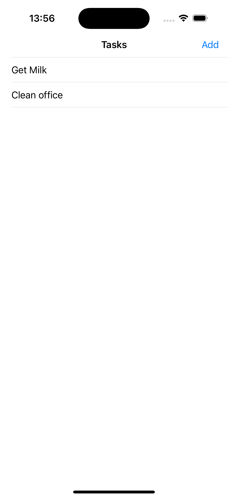
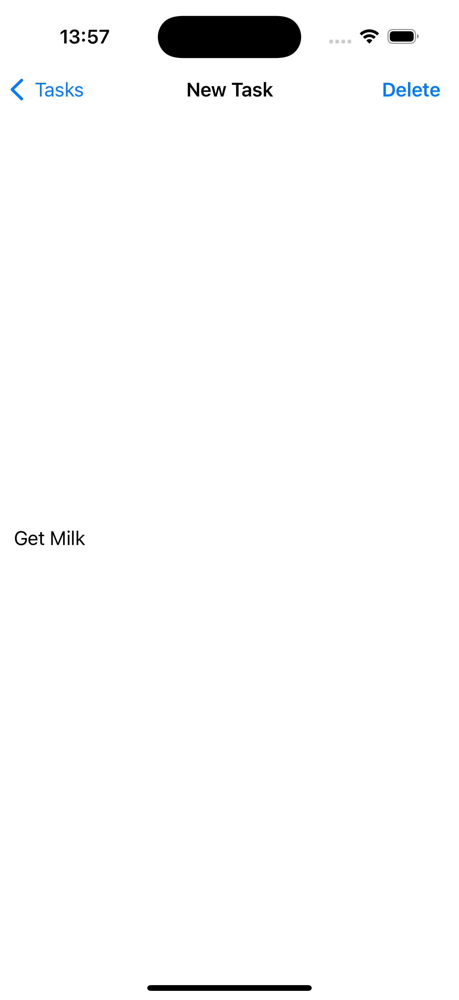
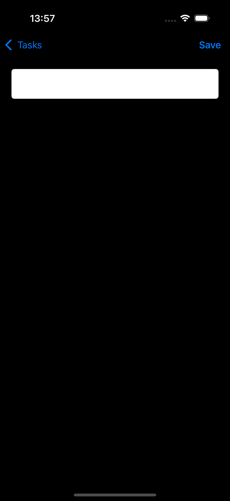

# To-Do iOS App – Basics
This simple application provides a brief introduction to how the Swift programming language works. It demonstrates the process of creating and deleting data within an array and showcases how the user interface (UI) responds and updates accordingly. This demo serves as a foundational example for understanding Swift and its interaction with UI components.

## UI samples

